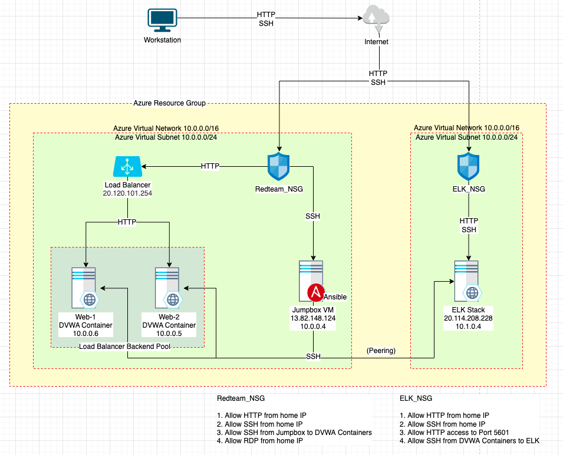
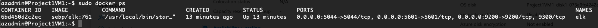
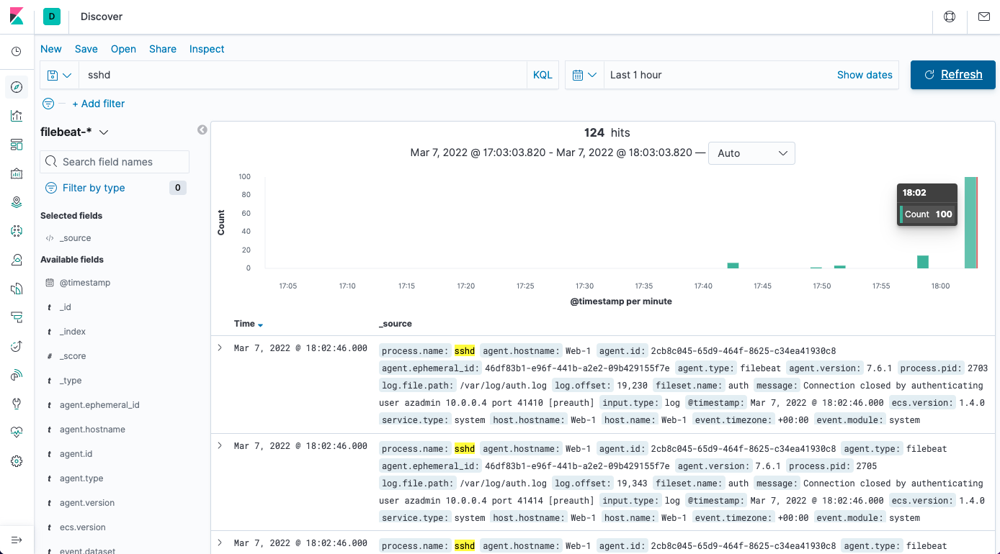
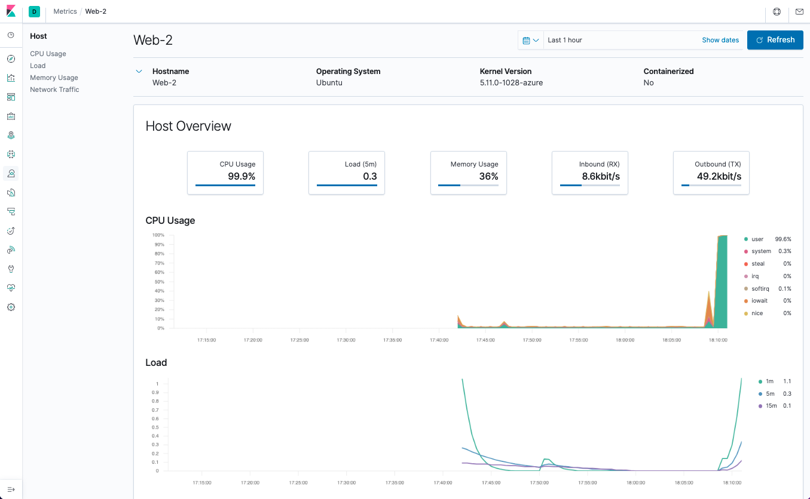
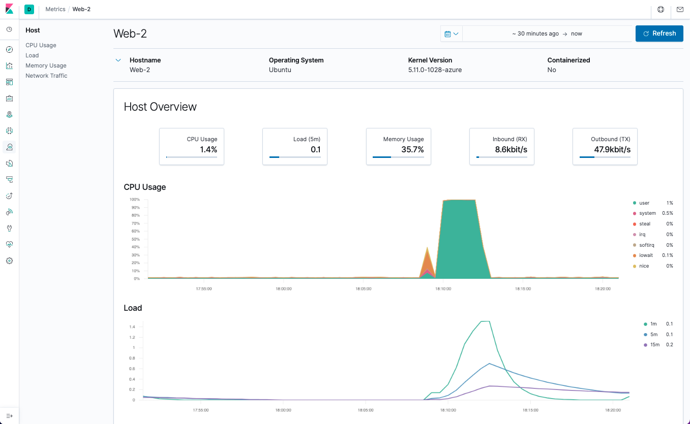

## Automated ELK Stack Deployment

The files in this repository were used to configure the network depicted below.



These files have been tested and used to generate a live ELK deployment on Azure. They can be used to recreate the entire deployment pictured above. Alternatively, select portions of the Ansible playbook file may be used to install only certain pieces of it, such as Filebeat.

  - [install-elk.yml](install-elk.yml)
  - [filebeat-playbook.yml](filebeat-playbook.yml)
  - [metricbeat-playbook.yml](metricbeat-playbook.yml)

This document contains the following details:
- Description of the Topology
- Access Policies
- ELK Configuration
  - Beats in Use
  - Machines Being Monitored
- How to Use the Ansible Build


### Description of the Topology

The main purpose of this network is to expose a load-balanced and monitored instance of DVWA, the D*mn Vulnerable Web Application.

Load balancing ensures that the application will be highly available, in addition to restricting malicious traffic to the network via its security rules. The Jumpbox provides a single entrypoint for managing the VMs in the virtual network. This is beneficial because it requires only a single port for access via SSH or RDP which reduces the attack surface.

Integrating an ELK server allows users to easily monitor the vulnerable VMs for changes to the data and system logs.
- Filebeat monitors log data and forwards it to either Elasticsearch or Logstash.
- Metricbeat monitors metrics and forwards it to either Elasticsearch or Logstash.

The configuration details of each machine may be found below.

| Name      | Function       | IP Address | Operating System |
|-----------|----------------|------------|------------------|
| Jumpbox   | Gateway        | 10.0.0.4   | Linux            |
| Web-1     | Web Server     | 10.0.0.6   | Linux            |
| Web-2     | Web Server     | 10.0.0.5   | Linux            |
| ELK Stack | ELK Server     | 10.1.0.4   | Linux            |

### Access Policies

The machines on the internal network are not exposed to the public Internet. 

Only the Jumpbox Provisioner and ELK Stack(?) can accept connections from the Internet. Access to this machine is only allowed from the following IP addresses:
- 68.126.204.104

Machines within the network can only be accessed by the Jumpbox Provisioner. The machines and IP addresses that are allowed to access the ELK VM are:
- Jumpbox VM Ansible Container 13.82.148.124 and 10.0.0.4

A summary of the access policies in place can be found in the table below.

| Name      | Publicly Accessible | Allowed IP Addresses            |
|-----------|---------------------|---------------------------------|
| Jumpbox   | No                  | 68.126.204.104                  |
| Web-1     | No                  | 10.0.0.4                        |
| Web-2     | No                  | 10.0.0.4                        |
| ELK Stack | No                  | 68.126.204.104<br>13.82.148.124 |

### Elk Configuration

Ansible was used to automate configuration of the ELK machine. No configuration was performed manually. Configuration is achieved with Ansible playbooks which have several advantages such as:
- Simple: Ansible playbooks are human readable
- Powerful: Can deploy apps and manage workflow
- Agentless: No requirement for special agents on client machines

The playbook implements the following tasks:
- Increase system memory
- Install Docker & Docker.io
- Install Python3
- Install ELK container

The following screenshot displays the result of running `docker ps` after successfully configuring the ELK instance.



### Target Machines & Beats
This ELK server is configured to monitor the following machines:
- Web-1 20.120.101.254 / 10.0.0.6
- Web-2 20.120.101.254 / 10.0.0.5

We have installed the following Beats on these machines:
- Web-1: Filebeats and Metricbeats
- Web-2: Filebeats and Metricbeats

These Beats allow us to collect the following information from each machine:
- Filebeats collects log data (e.g. Web logs)


- Metricbeats collects metrics and system statistics (e.g. CPU usage)

 
### Using the Playbook
In order to use the playbook, you will need to have an Ansible control node already configured. Assuming you have such a control node provisioned: 

SSH into the control node and follow the steps below:
- Copy the `filebeat-config.yml` file to `/etc/ansible/`.
- `curl https://gist.githubusercontent.com/slape/5cc350109583af6cbe577bbcc0710c93/raw/eca603b72586fbe148c11f9c87bf96a63cb25760/Filebeat >> /etc/ansible/filebeat-config.yml`
- Update the `/etc/ansible/filebeat-config.yml` file to include

line #1106
```
output.elasticsearch:
hosts: ["ELK_IP:9200"]
username: "elastic"
password: "changeme"
```
and line #1806
```
setup.kibana:
host: "ELK_IP:5601"
```

**Filebeat and Metricbeat**

[filebeat-playbook.yml](/filebeat-playbook.yml)
- Run the Filebeat playbook using `ansible-playbook filebeat-playbook.yml`.
- Ensure the correct machines in `hosts: [your machine]`
```
- name: Install Filebeat, copy Filebeat config file
  hosts: webservers
  become: true
  tasks:
```
- To check that the installation worked, navigate to the Filebeat installation page on the ELK server GUI. Scroll to **Step 5: Module Status** and click **Check Data.**

[metricbeat_playbook.yml](/metricbeat-playbook.yml)
- Run the Metricbeat playbook using `ansible-playbook metricbeat-playbook.yml`
- Ensure the correct machines in `hosts: [your machine]`
```
- name: Install metric beat
  hosts: webservers
  become: true
  tasks:
```
- To check that the installation worked, navigate to the Metricbeat installation page on the ELK server GUI. Scroll to **Step 5: Module Status** and click **Check Data.**

### Misc Information
The following are examples of how the ELK server can be used from an incidence response perspective.
**Example 1: Failed SSH Attempts**

A user made 100 repeated attempts to connect to Web-1 via SSH using a shell script. Filebeats is able to capture the log data.


**Example 2: CPU Stress**

Web-2 is experiencing a surge in CPU usage. Metricbeats is able to capture and visualize the data.


**Example 3: Wget-DoS Attack**

Web-2 experienced a DoS attack using Wget. A shell script sent 100 Wget requests which Metricbeats was able to capture and visualize.

